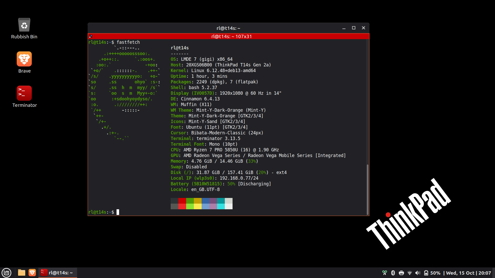

# Thinkpad T14s Gen 2 AMD

This repository collects notes, tweaks and configuration snippets I use to customise my ThinkPad T14s Gen 2 AMD running LMDE 7.

Use this document as a living table of contents for the repo. Each section links to a focused guide or configuration file.

## Table of contents

1. System overview
	- [System info](system-info.md) — Hardware, kernel and environment details captured with inxi and upower.
2. List of my favourite apps
	- [My favourite apps](my-favourite-apps.md) — Short list of software I rely on.
3. Display and UI
	- [Gamma fixes](gamma-fix.md) — Fixed display gamma with a user systemd service and notes.
	- [GTK styling tweaks](gtk-styling/gtk-styling.md) — Custom `gtk.css` adjustments to highlight active window using coloured borders.
	- [Thinkpad wallpaper](wallpaper) — Wallpapers for Thinkpad.
4. Input and pointing devices
	- [Trackpoint tweaks](trackpoint/trackpoint.md) — Smoother TrackPoint tweaks for my ThinkPad.
5. Power management
	- [TLP notes](power-management/tlp/tlp.md) — Installing and configuring TLP for battery life.
	- [Battery charge thresholds](power-management/battery-charge-threshold/battery-charge-threshold.md) — How to set start/stop thresholds without TLP.
6. Boot & firmware
	- [Faster boot time notes](faster-boot-time/faster-boot-time.md) — `systemd-analyze` and services to consider disabling.
	- [GRUB theme for ThinkPad](grub-theme-thinkpad/grub-theme-thinkpad.md) — Personal customization of GRUB theme for ThinkPad inspired by [hyperfluent theme](https://github.com/Coopydood/HyperFluent-GRUB-Theme).
7. Troubleshooting
	- [Cracking sound on boot](troubleshoot/cracking-sound-on-boot.md) — Workaround for audio crackle on startup.

## Using these customizations

- These are personal customization notes and examples; treat them as guidance, not a polished distribution/package.
- When applying system-wide changes (services, modprobe, udev, GRUB), review commands before running and keep backups (for example: copy config files before editing).

## Layout of this repository

- Root README (this file): docs index and TOC.
- Individual guides are stored as Markdown files organised by topic (power-management, grub-theme-thinkpad, gtk-styling, bugs, etc.).