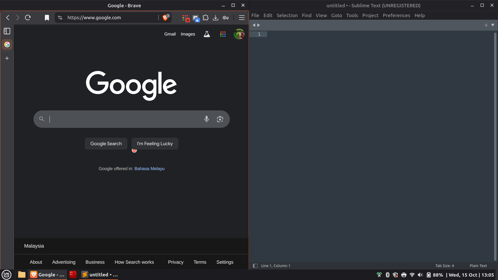
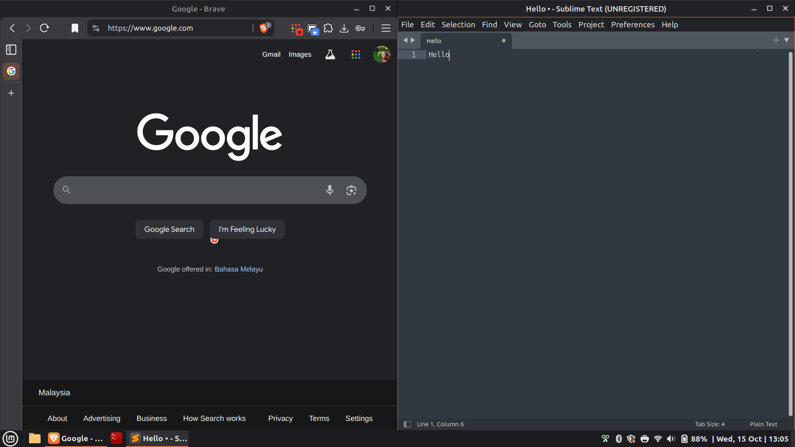

# GTK Styling

## Preview




_*Note the border highlight on active window_

## Quick Installation

### 1. Original resource:
   - gtk.css from [https://github.com/the-allanc/minty-color-titles](https://github.com/the-allanc/minty-color-titles)
### 2. Copy to ~/.config/gtk-3.0/gtk.css
### 3. Edits made to the original gtk.css

Comment the coloured headerbar for active window
```
/*headerbar {
    box-shadow: none;
}

headerbar:not(:backdrop),
headerbar:not(:backdrop) button:not(:backdrop) {
    color: @active_window_fg_color;
    background-color: @active_window_bg_color;
    background-image: none;
    border-color: @active_window_bg_color;
    text-shadow: none;
    -gtk-icon-shadow: none;
}

headerbar:backdrop,
headerbar:backdrop button:backdrop {
    color: @inactive_window_fg_color;
    background-color: @inactive_window_bg_color;
    background-image: none;
    border-color: @inactive_window_bg_color;
}*/
```

Add border highlight to active window on Cinnamon
```
/*Border colour for active & inactive windows*/

decoration:not(:backdrop) {
border-top: 1px solid @active_window_bg_color;
border-bottom: 1px solid @active_window_bg_color;
border-right: 1px solid @active_window_bg_color;
border-left: 1px solid @active_window_bg_color;
background : @active_window_bg_color;
}

decoration:backdrop {
border-top: 1px solid @inactive_window_bg_color;
border-bottom: 1px solid @inactive_window_bg_color;
border-right: 1px solid @inactive_window_bg_color;
border-left: 1px solid @inactive_window_bg_color;
background : @inactive_window_bg_color;
}

headerbar.titlebar:not(:backdrop) {
/*border-top: 1px solid @active_window_bg_color;*/
border-bottom: 1px solid @active_window_bg_color;
/*border-left: 1px solid @active_window_bg_color;*/
/*border-right: 1px solid @active_window_bg_color;*/
}

headerbar.titlebar:backdrop {
border-bottom: 1px solid  @inactive_window_bg_color;
}

```

Change all background image for titlebuttons to square
```
    background-image: -gtk-gradient(radial, center center, 0, center center, 0.8, to(@inactive_window_fg_color), to(transparent));
```
