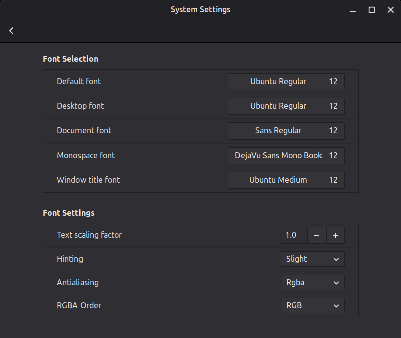

# Apps Custom Scaling

### System settings

- Display > Monitor scale: 100%

- Font Selection:
<p align="center">

<p/>

### Sublime Text

1. Open Sublime Text.
2. Go to the menu and select Preferences > Settings. This opens two panes, one with default settings and one for user settings.

3. In the right-hand pane (your User settings file), add the "ui_scale" setting with your desired value. For example, I use for 120% scaling, use 1.20:

```json
{
    "ui_scale": 1.20
}
```
> [!IMPORTANT]
> You may need to add a comma if you have other settings present in the file.

4. Save the file. The change should take effect immediately or after a restart of Sublime Text.

5. You can also adjust just the editor font size separately by adding "font_size": 14 (or another value) to the same settings file. 

### Brave Browser

1. Find all Brave Browser `.desktop` file

Common locations:

- `/home/[user]/.local/share/applications/`
- `/usr/share/applications/`
- If you have the app shortcut on Desktop: `/home/[user]/Desktop/`

2. In each Brave Browser `.desktop` file there are 3 different lines with `Exec=`

3. Add `--force-device-scale-factor=1.20` flag to the end of all `Exec=` lines but before the %U or any other variable. 

4. Save file.

5. Add also the same flag to Brave Browser launcher.

6. Relaunch Brave Browser.

> [!NOTE]
> If the fonts on some sites are still small, you can manually adjust the Zoom level and Brave Browser will remember the zoom level for that particular sites.

### VS Code

- Do the same as Brave Browser